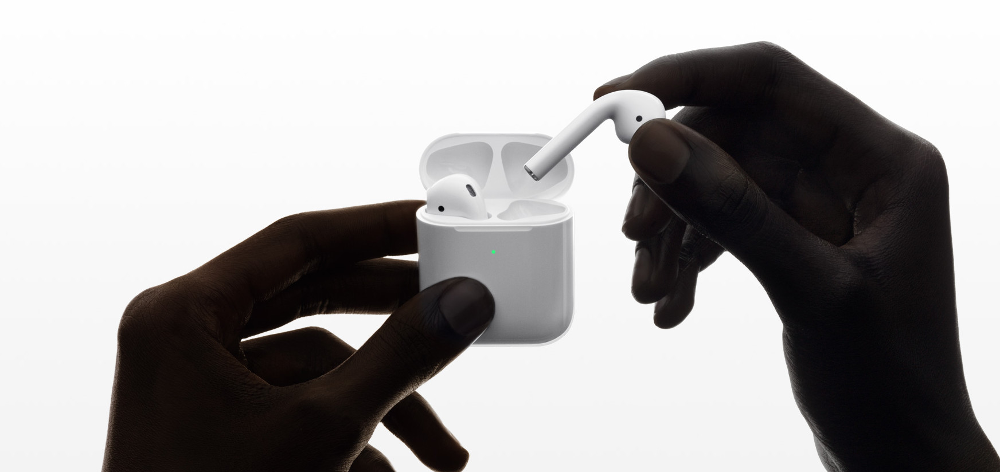

### 谁最先取消耳机孔的？

- 只算智能机时代的话，最早是 OPPO 的 R5，因为以超薄手机作为卖点，整机厚度只有 4.85mm，没办法放下 3.5mm 耳机孔。然后比较为人所知的是 2016 年乐视超级手机 2 取消耳机孔，当时已有传闻苹果即将取消耳机孔，所以乐视这一举动在数码圈引起了非常大的反响。
- iPhone7 发布之后，取消耳机孔不仅在数码圈引起震动，普通消费者也非常关注这个“反人类”的设计，吐槽之声甚嚣尘上。
- 之后就是国产厂商的争相模仿，比如小米 6，P20 等。到 2018 年，一款拥有 3.5mm 耳机孔的手机能以此为亮点宣传。到 2019 年，除了低端机，旗舰手机几乎都不再配备耳机孔。不管你有多么不舍耳机孔，多么痛恨这种盲目跟从的行为，耳机孔都将步入历史的尘埃了。

### 取消耳机孔的利弊？

- 直观来看，取消耳机孔可以节省手机空间，放下更大的电池或者更大的震动马达，减少厚度，甚至更好做防水设计，这是符合手机进化趋势的——机身开口越来越少。
- 用户成本增加，3.5mm 耳机无法使用，需要使用转接器或者购买 Type-C 耳机才能听歌，充电与听歌相冲突。由于 Type-C 直出数字信号，一旦转接器的 DAC（解码器）比较烂，音质表现会很差。目前Type-C耳机都做的比较差，没有比较好的选择。做的比较好的转接线，如 HTC 肠线、魅族 HIFI 线等，都是比较贵的产品，约 100 上下。

### 苹果做了什么？

- iPhone7 相对 iPhone6s，增加了 IP67 防溅，防水，防尘，重量减少了 5g，塞进了一颗更大的横向线性震动马达。
- 推出了 Airpods 无线蓝牙耳机，以其与 iPhone 天衣无缝的配合使用体验和优秀的延迟、稳定性，领跑了真无线耳机市场近 3 年，到如今能超越一代 Airpods 的都没有几个。

### 友商做了什么？

印象中最先跟进的是魅族的 POP，但是口碑比较差。小米到 2018 年推出了 AirDots，QCY 代工的真无线耳机，算是低价中最好的选择。华为 FreeBuds 推了几代也是反响平平。三星最近推出的 Galaxy Buds 倒是在音质上达到了比较好的水准。OPPO 有一款 O-Free，主打 LDAC，并没有激起多大的水花。索尼降噪豆一代，翻车严重，到三代开始，终于完成口碑的逆转。

### 总结

- 取消耳机孔是手机发展的必然结果，真无线耳机的成熟证明了这一趋势是正确的。
- 在这一发展过程中有很多不便，对消费者非常不友好，这是毋庸置疑、无法辩驳的。
- 苹果取消耳机孔不是恶，其他厂商盲目跟随，既给不出好的解决方案，也没有在机身设计上体现出取消耳机孔的好处，这才是恶。西施不是恶，东施才是。

### 最后

Airpods 真是太好用太方便了，在我买它之前还会害怕是否浪费了钱，在我买了之后，我是真觉得它值这个价，甚至让我义无反顾扔掉我的有线耳机。