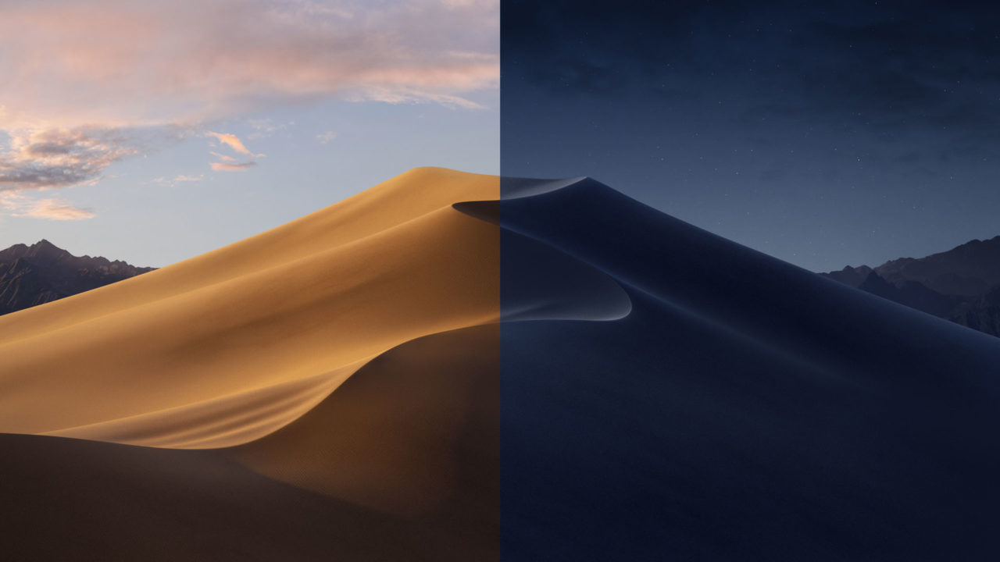

### 起因

UP 主讲 IOS 手势 / 动画的时候，批评了下安卓的手势 / 动画，评论认为这是踩一捧一，更离谱的是有人认为动画根本不重要，做不做动画是两种选择，没有高低之分...... 我真想让它关掉所有过渡动画用用手机 / 电脑试试。

### 思考

随后我开始思考，什么是踩一捧一，细想下这个词就很离谱，因为有对比必然有高低之分，只要不符合别人的心意了，他就可以说你是踩一捧一。私以为，有偏向性地对比，给出屁股明显歪的结论，这是踩一捧一。如果是事实对比，没有偏向性地指出各自的优缺点，就不是踩一捧一，当然是否有偏向性还得看听者的心意。

在交互动画上，安卓确实不如苹果，为什么就不能对比呢？UP 主并没有聊别的，标题就是吹苹果的交互，本来也不是手机评测。UP 主做这个视频可以不谈安卓吗，这样就不存在踩一捧一了。可能吗？不可能，都是手机系统，互为竞争对手，谈 IOS 的优势怎么可能不去谈安卓。吹安卓开放性的时候，难道不是对比苹果的封闭吗，总不能去对比 WIN 吧？吹安卓开放，批评苹果封闭是不是也是一种踩一捧一呢？

关于动画上客观的对比，难道不是对安卓的鞭策？MIUI 和 Flyme 的软件工程师为什么要优化动画效果？一加 7 Pro 为什么要上高刷新率的屏幕？不就是为了更好的动画效果，更好的交互体验。

国产手机发布会喜欢在 PPT 吊打苹果，这是踩一捧一吗？说到这里有人又会说，苹果也在发布会上对比别人，你这是踩一捧一。其实看看华为的 PPT 柱形图画的什么样，苹果的柱形图画的什么样，就能明白到底是不是踩一捧一了。说到这里，又有人会说，你这是踩一捧一。

按照某些人的思路，所有做对比评测的媒体都没法做了。A 手机的续航比 B 手机好。踩一捧一，为什么不说 B 的屏幕比 A 好呢？好我说，B 的屏幕比 A 好。踩一捧一，为什么不说 A 的续航比 B 好呢？太难了，明摆着的高下之分，不顺他心意了就是踩一捧一。

### 观点

我们应该这样判断别人是否踩一捧一，当对方说一件事的时候，有没有做对比？没有对比，那吹的再响亮，你也不能去评论巴拉巴拉自己开始不服开始自行对比，这就是杠了。值得一提的是，这种没有对比的文章一般是软文。如果有对比，是否客观也是一个衡量因素，这个因素决定了是否踩一捧一。可是客观与否本来就是件主观的事，踩一捧一自然也是个主观的扣帽子行为。

讲到这里，我觉得这个词实在太恶臭了，只要看到别人的对比不合心意，随便就可以扣上一顶踩一捧一的帽子。这个词还是少用为妙，否则容易变成精神股东。