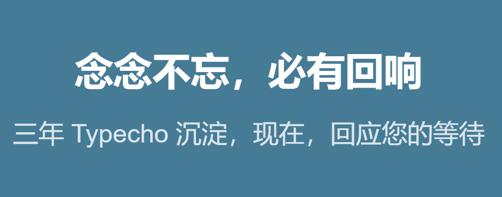
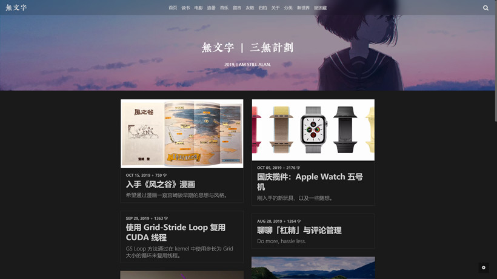
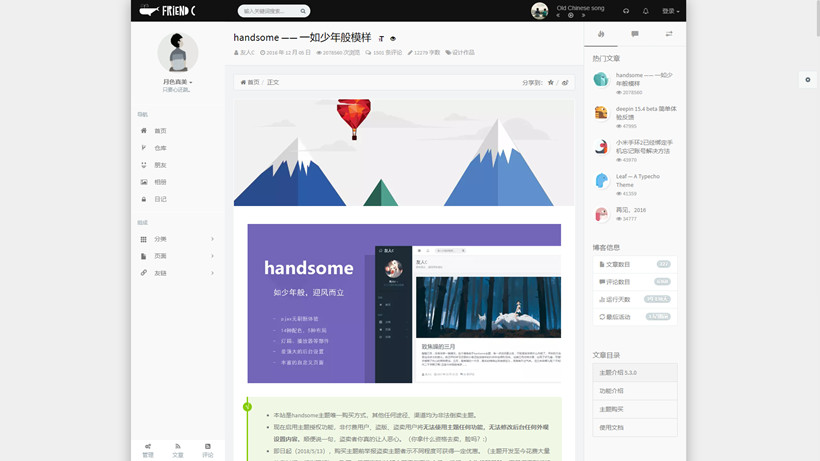
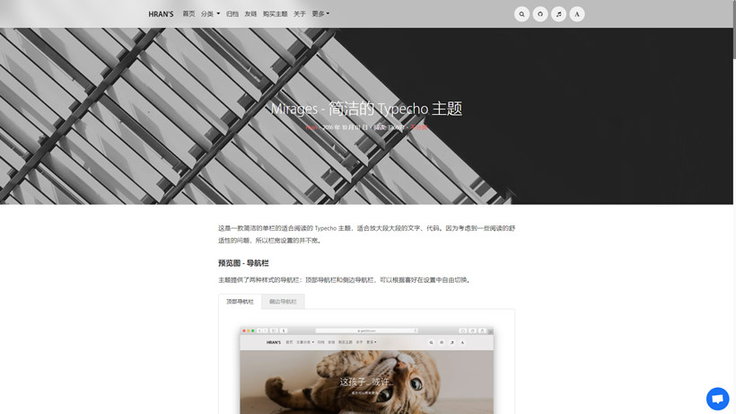
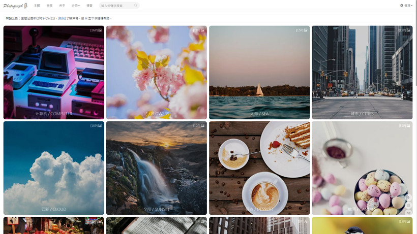
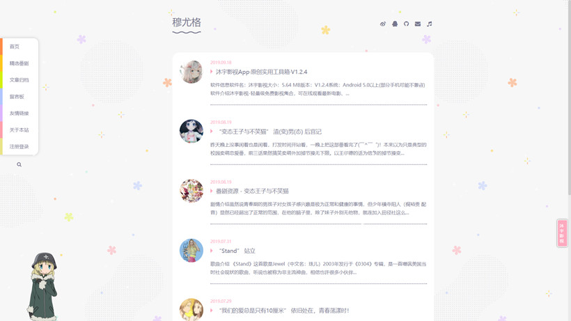
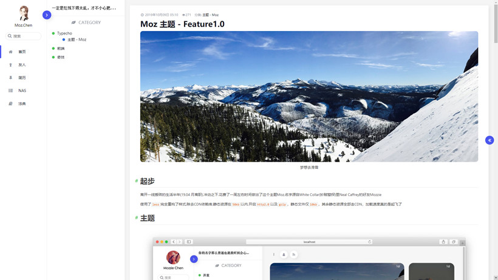

### 主题

VOID：[VOID：现在可以公开的情报](https://blog.imalan.cn/archives/247/)

- 本博客使用的主题，风格简洁，非常符合我的口味，尤其是夜间模式，太爱了。

Handsome：[handsome —— 一如少年般模样](https://www.ihewro.com/archives/489/)

- 非常清新的一款主题，收费主题，功能有保障。

Mirages：[Mirages - 简洁的 Typecho 主题](https://get233.com/archives/mirages-intro.html)

- 大气简洁，不过很吃配图，收费主题，完成度非常高。

Photograph：[Photograph 照片站](https://photo.siitake.cn/docs/#/)

- 用来做照片站再适合不过，不过限于 Typecho 的简陋，功能性上可能没那么好。有免费版可以体验。

Fantasy：[Fantasy 幻想动漫风主题](https://paugram.com/coding/fantasy-theme.html)

- 动漫风，粉粉的，适合女孩子。

Moz：[Moz 主题 - Feature1.0](https://www.npmrundev.com/archives/4/)

- 很棒的三栏主题，简洁风。

### 插件

Mailer：[Mailer：又一款评论邮件提醒插件](https://blog.imalan.cn/archives/349/)

- 用来做邮件提醒，不会错过任何一条评论。由 VOID 作者开发。强烈推荐使用邮件插件，不然很容易忽略评论。

DoubanBoard：[Typecho-Plugin-DoubanBoard 发布](https://blog.imalan.cn/archives/168/)

- 同样由 VOID 作者开发，在你的博客展示你的豆瓣读书和电影，自动同步，非常 nice。

Access：[Access-Typecho仿百度统计插件](https://qqdie.com/archives/access-typecho-plugin.html)

- 贴百度统计或者谷歌统计代码固然数据更加丰富，但是 Access 够用的功能，嵌入后台的设计，还是很合我胃口。

Pio：[给你的博客增加动态看板娘](https://paugram.com/coding/add-poster-girl-with-plugin.html)

- 看到左下角那个小埋了吧，就是用这个插件实现的，太可爱了。

ActivatePowerMode：[Typecho 插件：ActivatePowerMode](https://blog.imalan.cn/archives/208/)

- 打字的时候有震动特效，很有意思，由 VOID 作者改进，在后台编辑器里也能使用了。

Tp2MD：[Tp2MD：导出 Typecho 文章与页面](https://blog.imalan.cn/archives/303/)

- 虽然迁移网站直接打包下载就行了，但是偶尔也可能需要导出文章的 MD 文件，这个插件可以满足。

APlayer：[APlayer](https://github.com/MoePlayer/APlayer-Typecho)

- 本博客的音乐页面即用的此插件，点开音乐 TAG 听歌吧。

ExSearch：[Typecho 搜索增强：ExSearch](https://blog.imalan.cn/archives/261/)

- 搜索增强，点击右上角放大镜可体验。

### 其他

[Typecho 主题模板站](https://www.typecho.me/)

- 百度搜索 Typecho 主题，第一个就是它了。

[Typecho 爱好者博客](https://qqdie.com/)

- 泽泽大佬的博客，现在成了 Typecho 资源站了，我有很多插件都是在这里找到的。

### 特殊

[Typecho 后台模板](http://qqexit.com/index.php/archives/22/)

- 让你的 Typecho 后台变得非常漂亮，非常 awesome。