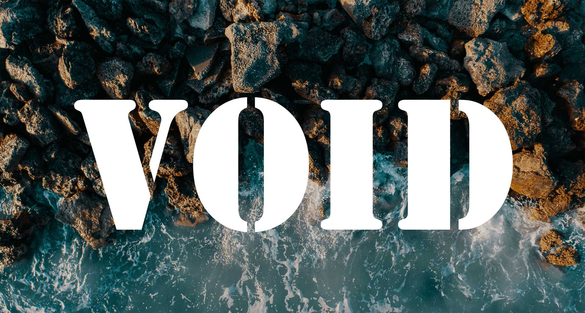

### 主题

（以下情况仅限 Typecho 下的 VOID 主题）

- 评论区开启 Markdown 后，还需要增加相应的 HTML 标签，才能有实际效果。 比如 Markdown 的超链接写法，你需要在评论设置 - 允许使用的 HTML 标签和属性，填写`<a href="">`，才能实现评论区的对应 Markdown 语法。
- 开启 PJAX 后体验会更好，较差的服务器会感觉加载快了一点。 
- 更新主题直接覆盖，是不会丢失配置的，有些主题内置了备份还原功能，具体看 [泽泽大佬](https://qqdie.com/archives/typecho-templates-backup-and-restore.html) 这篇文章。
- 超高级配置就是另外的一些功能，如修改夜间模式时间，修改默认字体大小。 具体怎么使用，看主题里的 advanceSetting.sample.json 文件就明白了。
- 个人感觉默认字体 16px 更好看，你看作者都是 16px。 
- 博客图片不多，想把图片留在自己服务器怎么办，在类似归档的独立页面上传图片，再引用就是了。需要注意的是，这可能会使网页加载缓慢，最好还是放在图床。 
- 找文章配图好难，所以我从来不加配图。真香。
- 关于网站图标，也就是页签上的小图标，可以在 head 标签里用`<link rel="shortcut icon" href="">`来配置
- 伪静态配置，就是让地址栏的 index.php 消失，链接变得更简洁，网上有很多教程，视服务器而定。这里主要是想说，强烈建议配置伪静态。
- ~~图片裁剪到宽度 820 px，放在文章里正好。~~更新：单张插入的时候是自动适应页面宽度的，忘记当时为什么要自己裁剪，奇怪。用图集排版时，超过页面宽度的话，在超高级设置里把大图集设置为 false 即可。

### 插件

- Mailer：邮件提醒插件，QQ邮箱是 587，TLS，需要生成授权码，再连接失败可以提交工单反馈，一般是端口问题。 
- Douban­Board：豆瓣电影插件，虚拟主机有可能不支持访问豆瓣，解决方法是，在本地或者能访问的主机里设置插件，访问电影页面后，将生成的 json 文件手动上传，麻烦是麻烦了点，但也没办法。 
- Ac­cess：因为添加百度统计代码后，广告插件居然会识别出来，感觉博客脏了...所以要我添加百度统计代码是不可能的，去百度网站看统计也很难受，太复杂了，这个时候仿百度统计插件真的很好用。
- Aplayer：很好用，不过现在只有网易云跟酷狗还能解析，其他都失效了，嘛，随便弄一个 100 首的歌单就 OK 啦。 可能需要在 PJAX 里重载一下。 