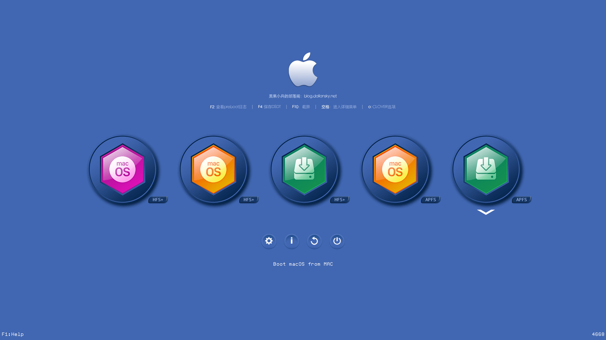

折腾黑苹果的过程中，我先后经历了花 30 元开通百度网盘超级会员并被全程限速，外接的 1080P 显示器在 Mac OS 下字体发虚看得我眼睛快瞎了，以及 U 盘由于莫名问题在 Windows 下无法读取，即便使用 DiskGenius 分区后也无法指派驱动器号，最后发现是驱动问题，用驱动人生重装了一下 USB 驱动才解决。最后总结为：花了 30 块钱重装了 Windows10。

以下是折腾过程中总结的一点微不足道的经验：

### 如何确定自己的笔记本能否安装黑苹果？

- 最简单也是最缺德的方法，淘宝搜索黑苹果，将配置单发给客服，就可以得到客服热情洋溢的介绍。
- 访问黑果小兵的博客，链接：[Hackintosh黑苹果长期维护机型整理清单](https://blog.daliansky.net/Hackintosh-long-term-maintenance-model-checklist.html)。查找是否有你的机型，点击对应的链接跳转到 GitHub 即可下载对应的 EFI 文件，一般也会有一些同机型的配置方法。
- 如果你是想在 1080P 的外接显示器上使用，可以放弃了，字体发虚问题即使开启 HiDPI 也无法解决。

### 如何安装？

1. 首先准备一个 U 盘，建议 16G。

2. 下载系统镜像，黑果小兵博客提供的镜像集成了通用 EFI，还可以支持 Clover 里直接修改硬盘引导，适合新手使用，后面修改好引导再换成 GitHub 获得的 EFI 文件是可行的。这里有大佬可能会提出质疑，我解释一下：

   因为我从 GitHub 下载的 EFI 文件并不是完美的，直接使用它安装出现了修改硬盘引导失败的情况。之后用黑果小兵的镜像安装，通过它自带的 Clover 成功修改好硬盘引导，再换回 GitHub 的 EFI，最终才完成黑苹果的安装。

   如果你确认 GitHub 的 EFI 完美，当然是选择原版镜像更好。

3. 制作启动盘，使用 Etcher 或者 TransMac 工具。我是用的 TransMac，先 Format Disk for Mac，再 Restore with Disk Image，选取你下载的镜像，等待写入完成。

4. 如果是黑果小兵的镜像，建议直接下一步。如果是原版镜像，使用 DiskGenius 工具将你在 GitHub 下载的 EFI 文件替换到 U 盘的 EFI 分区内。

5. 修改 BIOS 设置，打开 UEFI，关闭安全模式，修改 U 盘为第一启动项。如何打开 BIOS 自行百度。

6. 开始安装 MacOS， 具体步骤都是图，看别人的吧：[联想小新Air 13安装黑苹果兼macOS Mojave安装教程]( https://blog.daliansky.net/Lenovo-Xiaoxin-Air-13-macOS-Mojave-installation-tutorial.html)。

7. 上一条的教程里提到使用 BOOTICE 工具修改硬盘引导，如果成功了固然好，如果像我一样失败了，可以参考这篇帖子：[不借助任何工具将CLOVER引导添加进UEFI的正确姿势]( https://blog.daliansky.net/Add-CLOVER-boot-to-UEFI-without-any-tools.html)。

   很多人不知道怎么回 Windows 系统，或者根本就把 Windows 抹掉了，可以用另一台电脑把 U 盘做成 WINPE 启动盘，插上去后在 WINPE 里是自带 BOOTICE 工具的。

   没有另一台电脑？要么一开始就准备两个 U 盘，一个 Mac，一个 PE，要么还是用黑果小兵的镜像为好，不需要进 Windows 就能修改硬盘引导。

### 安装完之后？

- 一个是修改 HiDPI，参考：[HiDPI是什么？以及黑苹果如何开启HiDPI]( https://www.sqlsec.com/2018/09/hidpi.html)。
- 其他我也没有过多使用，使用 GitHub 提供的 EFI 驱动基本正常，我就指个路吧：[黑苹果入门教程](https://github.com/SuperNG6/MSI-B360-10.14.6-EFI/wiki/%E9%BB%91%E8%8B%B9%E6%9E%9C%E5%85%A5%E9%97%A8%E6%95%99%E7%A8%8B)。

### 总结

不完全不详细不专业，仅仅是一些我遇到问题的解决办法和大体的流程，像驱动如何安装、台式机如何配置，我还没有搞明白。

可能这篇文章最有用的就是建议使用黑果小兵的镜像吧，可以不用进 Windows 就能修改硬盘引导。以后的黑苹果安装应当越来越简单，越来越傻瓜，能在 Clover 里解决的，就不要麻烦 Windows 了。