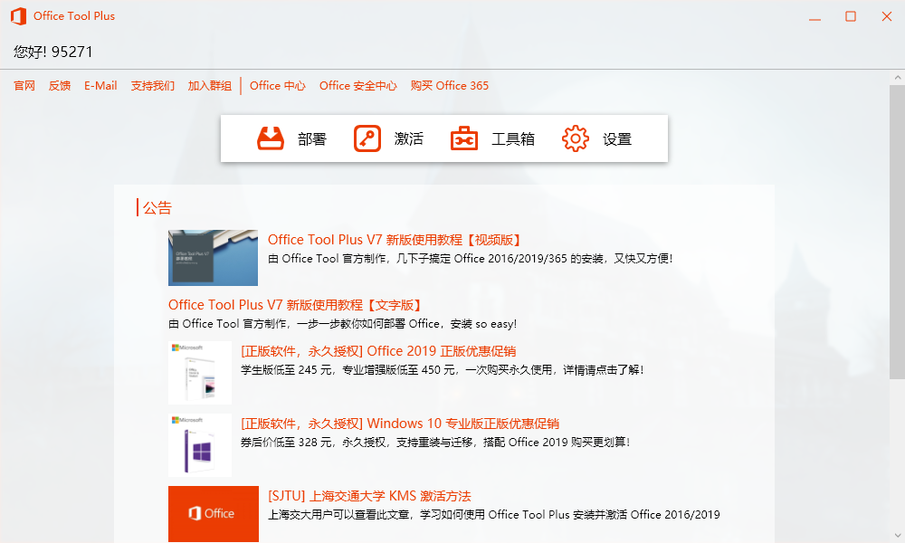
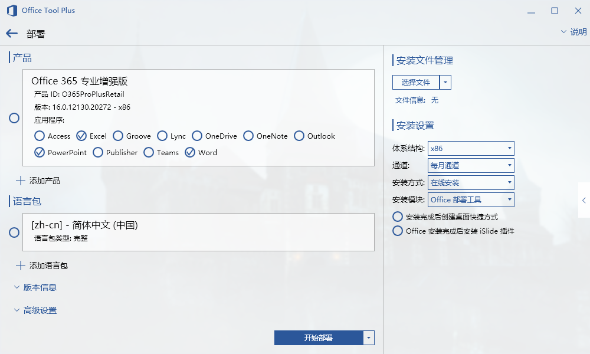
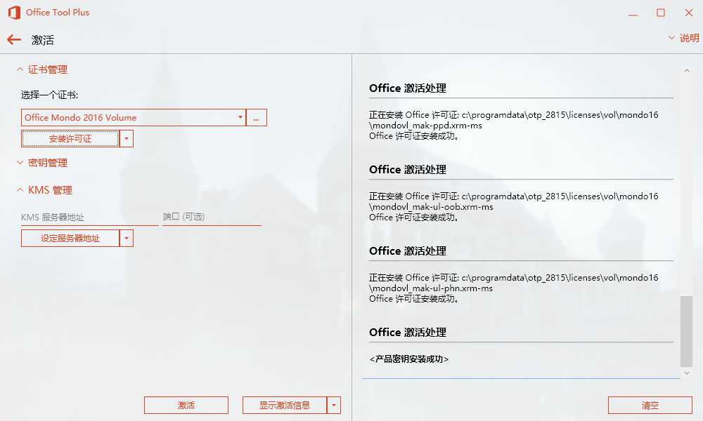
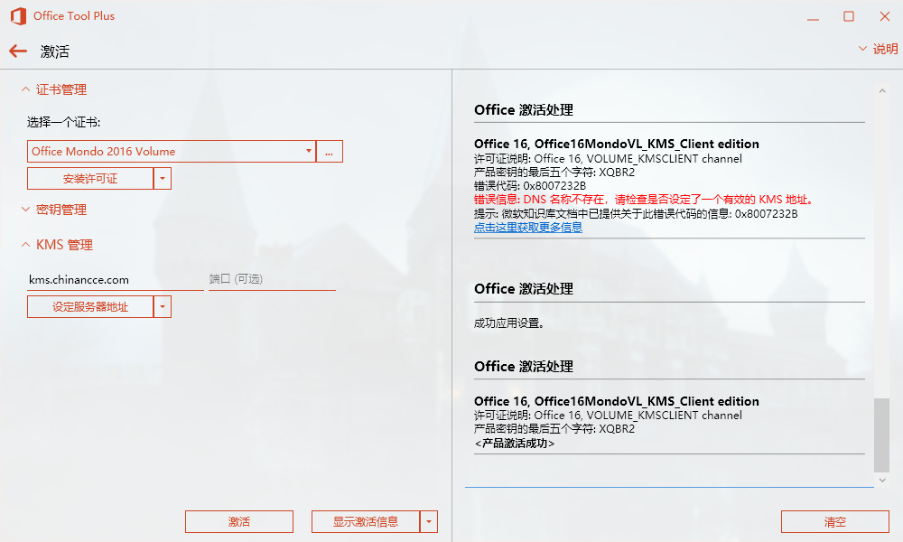

我曾经依赖于 WPS 的 F6 一键自动翻译来写 ISAS 英文论文，但是我现在毕业了，实在不想再用这个有广告（可关）、打开又缓慢的 WPS 了。

拥抱 Office，有很多办法，可以去 MSDN 下载镜像安装，但是那样无法自定义组件，像 OneNote、Outlook 我根本用不到。

今天我想介绍一款 Office 安装工具 —— Office Tool Plus，可以一键自定义安装 Office 套件，也可以一键激活你的 Office。

### 下载安装工具

官网下载即可：[Office Tool 官网]( https://otp.landian.vip/zh-cn/ )，解压后打开 Office Tool Plus.exe。

### 部署 Office

注意：安装前请卸载旧版 Office，卸载 WPS，关闭某些强力安全软件。

如上图是 Office Tool Plus 首页，点击部署打开部署页面，如下图：

点击添加产品，选择你想要安装的产品，勾选你想要安装的组件，像我只需要 Word、PowerPoint 和Excel。

语言包不必设置，会自动适配你的系统语言的。版本信息和高级设置也不必改动。体系结构看你需要装哪个，通道和安装模块也不必修改。

- 如果你的网络不好，请在安装方式里选择先下载再安装，点击开始部署，Office Tool Plus 会帮你下载镜像，然后自动打开 Office 安装工具，等待安装完毕。

- 如果你的网络够好，也可以选择在线安装，点击开始部署，这时会直接弹出 Office 官方工具下载镜像并安装，也是等待安装完毕。

额外问题解决方案，引用 Office Tool Plus 官方教程：

> 如果您在安装的时候选择了 Office 2019 批量版产品，请更改更新通道为 Office 2019 企业长期版，并且不可以与其他零售版产品混装，否则会出现问题。 
>
> 如果您在安装的时候选择了一些 Office 部署工具不支持的产品，请更改安装模块为 Office Tool Plus，这样可以绕 过 Office 部署工具的验证而直接开始部署 Office。  

### 激活 Office

如果您购买了正版 Office，打开 Office 后按提示登录账号即可。

Office Tool Plus 支持 KMS 激活，回到软件首页，点击激活打开激活页面，如下图：

首先按上图所示，清除激活状态，避免出错。

然后选择 Office Mondo 2016 Volume 证书，点击安装许可证，如下图：

等待，直到看到产品密钥安装成功。

在 KMS 管理里填入你搜到的 KMS 服务器地址，或者直接使用上图所示的地址，端口默认，点击设定服务器地址。

点击激活，等待，看到产品激活成功，就可以开始使用 Office 了。