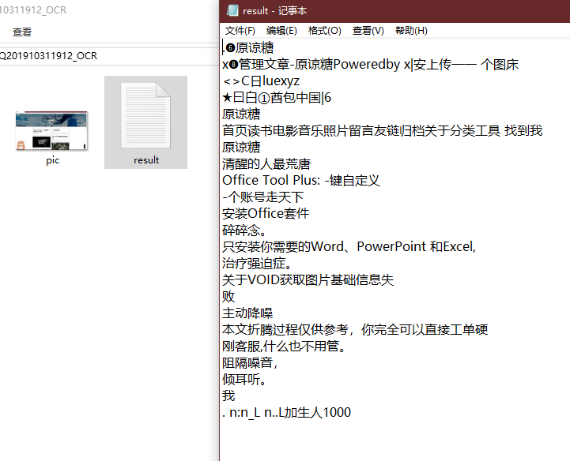
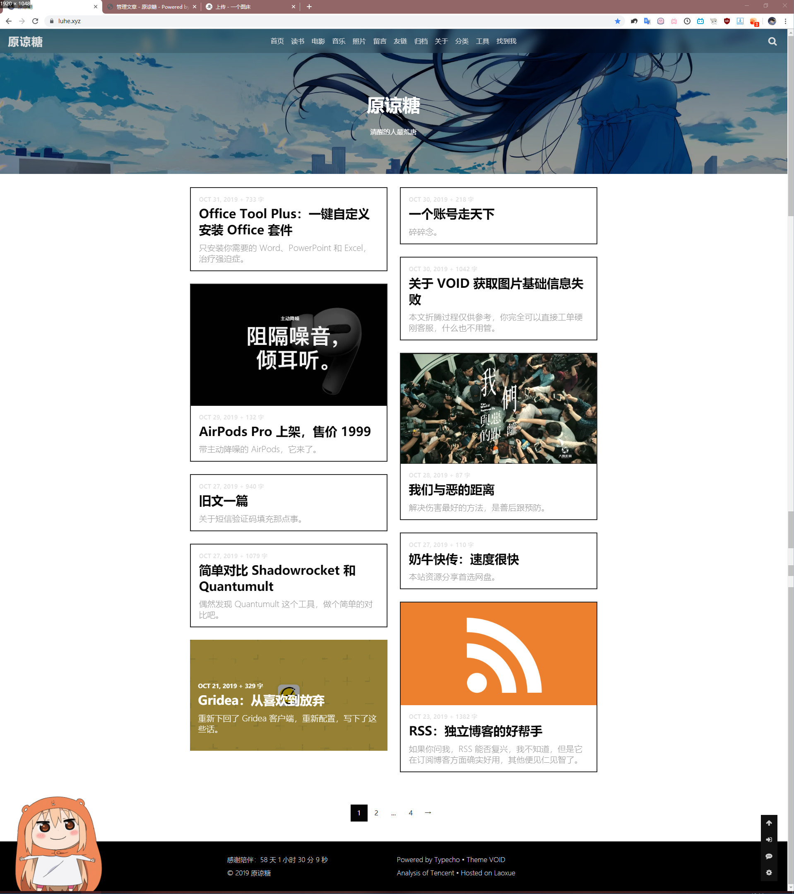

今天更新到 QQ 测试版，发现截图功能增强了很多，仔细一查发现 10.23 的正式版就已经有这些改动。

但我还是想聊聊这些改动，对于我来说，Windows10 自带截图加上这次升级后的 QQ 截图，实在太好用了。

### 自动识别边缘贴边

~~首先是 QQ 截图工具终于可以自动识别边缘贴边了，我最喜欢这个改动。以前 QQ 截图截某个窗口，会自动把窗口边缘外也截进去，非常丑，想放到博客上还得自己裁剪一番，很不方便。~~

然而我在配图的时候发现这个功能仅支持 QQ 的窗口，翻车之余我差点放弃写这篇文章...

还是建议使用 Windows10 自带的 Win+Shift+S 来截窗口，除了 QQ 界面不支持，其他界面支持都非常好。

### 序号笔工具

这个功能其实很多第三方截图工具都有，下面三个我要说的功能也是如此。只是 QQ 自带后，我倾向于不使用过多第三方工具，能少下一个软件是一个，这是我的个人习惯，也算是一种官方逼死同人（这场面有点像 IOS 出了新功能 2333）。如果哪天 Windows10 也增加了这些功能，我也不会再用 QQ 截图了。

序号笔功能也不用过多解释，用来做步骤演示再合适不过。

### 屏幕识图

这个在手机 QQ 上很早就有了，其实就是集成了 OCR 功能，还能一键保存图片和文字信息到文件夹内。

### 钉在桌面上

可以将截图放在系统最上层（覆盖所有窗口）供查看，可以随意移动。

### 长截图

这个功能还是很令我惊喜的，可以方便截网页了。

截好位置后点击长截图按钮，滚动鼠标滚轮即可实现长截图。

### 总结

其实不是什么新鲜的功能，只是我惊喜于 QQ 集成了这些功能，能方便更多小白使用上这些好用的功能，对于我来说也不用下载别的第三方工具来实现这些功能。

不管是电脑系统，还是手机系统，我都倾向于尽量少的软件，实现尽量多的功能，如果系统本身支持，就更完美了。