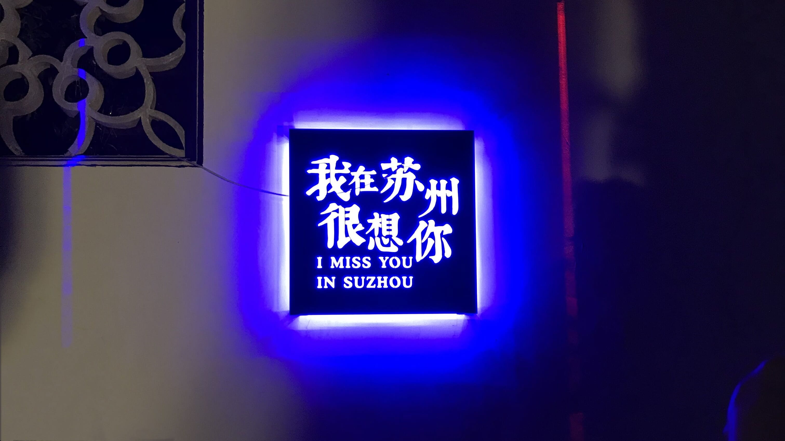

### Sep 1, 2009 大概是我们认识的时间

谁也不知道，六年后，我们会再见。

### Sep 1, 2015 他乡遇故知

我们高考都在同一个考场，考了差不多的分数，填了差不多的志愿，来到同一所大学，直到开学后才发现对方。可能这就是缘分吧。

### Nov 11, 2019 你说我们再也回不去了

四年付出，四年陪伴，我没有表白，你也没有拒绝。我压力好大，情绪激动中删了你。我后悔了，可是你却说，我们再也回不去了。

### Nov 22, 2019 我没办法忘记你

你可不可以回应一句，说什么都好。

### Nov 22, 2019 我写不下去了

要有多么强大的心，才能坚持回忆她而不难过。

----

“你不觉得你管得太多了吗” 

“对不起，再也不会打扰到你了” 

----

哈哈哈哈哈哈哈哈哈哈 

Dot Not For­get to Smile. 

Why so se­ri­ous? 

----

我没妄想，我不配，只是没想到，在她的眼里，我连关心的资格都没有，说话的资格也没有，强压下被安慰的资格更没有，什么都没有…… 

我，只有我。 

晚安。 

----

她从没有尊重过我，大一她谈男朋友，我是最后一个知道的，居然还问我：不是早就告诉你了吗？ 

那天我在网吧通宵。第二天当无事发生。 

后来某天一起在文鼎玩，玩着玩着想到上面的事，思绪崩溃到极点，回去的路上谁也不待见，第二天决定再也不理她了。 

那天我回复完，她说我好冷漠。 

一个月，我没找过她，她也没有找我。 

直到我重感冒躺床上一个星期，我才发现，我离不开她。 

算了，就这样吧。 

后来她分手的事情，一年后我才知道，还奇怪地问我：不是早就告诉你了吗？ 

不是早就告诉你了吗？这是我与她相处最常听到的话。 

不是早就告诉你了吗，买的南京南的车票？ 

不是跟你在这里吃过火锅吗，我记得是跟你啊？ 

我从没有奢望过什么，我只想着能有个可以倾诉的对象，让我觉得我不是一个人。 

我自闭，我社交恐惧，可是我还能在手机上跟她聊聊我遇到的事。 

挺好的。 

----

我最后悔的一件事就是拉她进金科海安之家这个群。 

我不喜欢群里的那个学长，因为他跟她走的很近，近到过年他们一起去看电影，开学之后我才知道。 

我最想知道的是，那年暑假，一起去苏州旅游时，在山塘街的某个酒吧，她写下的明信片，上面到底写了啥？ 

苏下山塘一盏酒，梦回纸帘不知书。 

----

对不起，从那年中考数学考场上，我思路闭塞，紧张到最后产生生理反应。 

从那时开始，我的人生轨迹已经偏移了。 

我无意诡辩如果那么，只是，我永远不配了。 

我真的只会玩，有一段时间我游戏搬砖能补贴生活费，可以少问家里要钱。 

我的 iPad 是打游戏爆装备买的。 

我玩了三年游戏，最后一年开始准备考研。 

我已经失去了学习的能力和毅力。 

我又失去了实习的机会。 

我在我爸的骚操作下，又失去了留在无锡的机会。 

我在家躺了半年，我不明白我能做什么。 

我出来做一份最基础的编辑工作。 

我受到我爸的压力。 

我跟她诉说，她说：我每天工作已经很累了，你还在给我传播负能量。 

我理解，真的很累。 

我说你钉钉头像不好看，显得人很憔悴。 

“你不觉得你管得太多了吗”

----

有一件事我记忆犹新，那天她在体育测验中没过，被老师为难了，在 QQ 上哭着诉说。 

我说我去找你，她说不用。 

我送她还没走到北区，她就不让我送了。 

我回到宿舍，不一会儿，她就发了一张宿舍聚餐的照片，看起来很开心。 

----

有一天，我送她去上吉他课，课上有一个人姓杨，杨也是通过金科海安之家认识她的，所以我为什么那么后悔拉她进群。 

杨喜欢她，杨是那种谈恋爱就喜欢人尽皆知的那种。 

我看着她和杨一起进教室，被一群人起哄的场面。 

我在外面窗口看了很久，走了。 

还好她不喜欢杨，我长舒了一口气。 

----

那天我跟她看完电影，她说要去逛街，让我赶紧走，说她闺蜜带了男朋友，等下会尴尬。 

我很想说有什么尴尬的，我接下来也没事做啊，一起吃饭都不可以吗？ 

然后我回到酒店点了外卖一个人吃。

----

为她开过亲密付。 

为她跑好几趟去竹山路修电脑。 

为她买过衣服，化妆品。 

为她送过吃的，伞。 

我们一起看过电影。 

我们一起去旅游。 

我们一起坐动车来学校，回家。 

我听过她吐槽谁谁谁怎么样。 

或许我现在也成了她吐槽的对象。 

我知道她害怕鬼，害怕血。 

我知道她喜欢吃鸡翅，花甲，板栗和脆骨。 

我知道她的爱豆从薛之谦到 BTS 到肖战王一博。 

对不起，我不会打惯蛋，害你每次都输。 

对不起，我不会唱歌，不喜欢去 KTV。 

对不起，我没有抢到陈情令的门票。 

对不起，我没有什么值得你喜欢的。 

所以我一直清醒地知道，不可能的。 

我明白，在她看来，在有的人看来，以上并没有意味着什么。 

我都明白。 

不那样，我也是很满足的。

----

我还想写，从他乡遇故知开始。

----

最近总是会梦到她。

我知道她不喜欢我，只是没想到她这么讨厌我。

四年付出换来一句“你不觉得你管得太多了吗”。

工作好难，我要怎么坚持下去。

----

我们从来没有什么共同爱好，几乎每一次我安利的分享，她都不会回复或者认可。

微博艾特她转发的微博，她也大概不会去看。

我大概能感觉到她的心境，没有共同语言的，不想理我的心态。

每当这个时候，我都在想，或许这样也好。

我跟她说过淘宝上买安眠药好难，她以一串点点点回复。

我跟她说过梦到过她，她以一串问号回复。

我不止一次地问自己，到底是喜欢她，还是依赖她呢，我不知道，在这纠结中不断煎熬。

我把她的照片当作壁纸，被发现了，我们都不知道该说什么好，然后就没有然后了。

她去团建，被要求跟一个男生合照，照片被发到钉钉群里。她只心烦自己的丑照被别人看到，我心里非常难受，但是表面上却不知道该作何反应。不知道该作何反应，才能不影响到现在的关系。

我曾经需要听半岛玫瑰的电台节目才能睡着，现在也是需要听着相声才能入睡。

我曾经听着她在全民K歌里唱的歌睡觉，可是好久没有更新了。

----

当她说出那句“你不觉得你管得太多了吗” ，我感觉到整个人崩溃了，我删除了微信好友，QQ好友，微博关注，手机通讯录。

整个人似乎被抽空了，回望四周，一个人也没有。

我在大学几乎没有交际，只跟舍友们交流，没有参加过社团，没有认识过多少人，新生群里认识的人，至今还没有见过面。

但是有她，我觉得就够了。

但是现在没有了，我的世界似乎空了。

当然，我还有亲人，还有那些很久没联系的朋友。

只是，觉得缺了什么。

我一直认为，性格决定命运，这句话放在我身上再合适不过。

----

过了两天，我在公司的电梯里碰到她，她非常着急地拿着外卖冲出电梯。

她为什么要这么累啊，这么辛苦，我好心疼。

我突然意识到，我没办法失去她。

我整个下午都在想她，工作完全不在心上。

熬了很久下班，我给她发短信，我说我没办法失去她。

我把上面的好多文字发给她。

她说，从我删她的那个时候，我们就回不去了。

她拉黑了所有联系方式。

我给她发邮件，发短信，打电话。

我再也没办法得到她的回应了。

----

我找她闺蜜，想要看她删我之前发的那条朋友圈，那条骂我的朋友圈，我还没来得及看完就被拉黑了。

她闺蜜说早就看出来我喜欢她了。

我说一大段话：

>我知道可能说出来就结束了，所以我就一直对她好，我想把她当成精神支柱，什么事情都想跟她说。
我那天压力太大，跟她说了很多，她没回复。第二天她说她工作很累，不想听我的负能量，我觉得好吧，工作确实太累了。
前几天我说她钉钉头像不好看，显得很憔悴，她说：“你不觉得你管得太多了吗”。我当时就崩溃了，本来压力就大，我情绪激动，删了她。
两三天我就坚持不住了，我觉得不能没有她。可是她已经不会再理我了，她似乎很讨厌别人删她。她说从我删了她开始，就不可能回去了。
现在我不知道到底该怎么办，我甚至不知道她是因为我删了她就无视一切，还是别的原因。我不知道她有没有看短信，有没有看我空间。发什么都石沉大海了。
我宁愿她直接拒绝我，也不要这样收场。还是她的沉默就是拒绝，我不知道。

她闺蜜沉默了很久，也可能是忙别的，也可能是跟她说话。

回了一句对不起帮不了我，秒删了我。

我差点崩溃，我没有求她帮我啊，我只想看个截图。

我好多次请她吃饭，她闺蜜都在场，最后居然秒删我，我还没说要她帮忙调解啊。

我真的要崩溃。

----

我喜欢了她四年，我没有表白，我害怕失去。

我很依赖她。

我以为即使她不喜欢我，也会安慰我，可是没有。

我压力好大，工作，家里。我跟她说。她说她工作好累，不想听我的负能量

我都不知道她到底是拒绝了我，还是只是因为我删了她，就可以无视所有的，四年的感情。

我不知道，凭什么，我到底为了什么，我想不通，我宁愿她跟我说不喜欢我，也不要现在这个样子，我到底算什么啊。

我来昆山就是因为她在这里，因为这家公司有好几家分公司，我故意选了个不是她的公司，结果签合同发现还是一家公司，现在我们在一层楼，我听着我们部门的人聊天都觉得刺耳，每一句我都会想到她，中午下楼害怕碰见她。

我不知道她有没有看到我的空间，我不知道她有没有看我给她发的短信，她什么也不说。

----

那天我删了她，她朋友圈发的是：妈的，神经病。

后来我加了她，她让我不要给她发了，然后拉黑了我，拉黑之前我看到她发了条朋友圈：现在的人都怎么回事，走就大大方方地走，煽情干什么，论狠心，没人狠得过我。

----

我知道，可能她从来没有理解过我，所以才会这样吧。

我已经想过无数次怎么去死了……

其实以前也有，但是我想有她，就一直坚持下来了。

我什么事都想跟她说。

----

我辞职了，一共工作了五天。

我退掉了租的房子，住了两个星期，押一付一，一分钱都拿不回来。

我一刻也呆不下去了，我害怕我会从她租的17楼的房子门口跳下去。

----

她的电脑是我拿去竹山路修的，固态硬盘是我买了换的，她某天打开电脑会想起我吗？

她有衣服是我买的，她会想起我吗？

她解除了微信的亲属卡，支付宝的亲密付还没有解除，某天她想起来解除了，我会不会崩溃？

----

我是不是应该去找她，当面说清楚一切。

她知道我不会说话，或许也知道我不敢去找她。

她曾经问我为什么没有人喜欢她，我不知道她想等一个什么回答，我小心地说会有的会有的。然后她就开心地笑了，说就是，肯定有的。

她曾经在打雷的时候害怕，让我打语音唱歌给她听，我说我不会唱歌，没有打语音过去。我好后悔。

我不知道她到底怎么想的，到现在都不知道。

----

我一个人坐了三个小时的公交车，从昆山到苏州山塘街。

我想找到她写的那张明信片。

在山塘街，一开始走错了方向，越走人越少，差点迷路，那种感觉太可怕了。

周围都是居民区，炒菜的味道，灯光很暗，路还越来越窄，我差点就想随便找个角落坐下来，再也不走了。

后来我走了好久，才到商业街。

找了好久才找到那个酒吧，拿着微博图片问店员是不是这家。

我找了两个小时的明信片，在那个环境下，驻唱歌手的歌声特别棒。

小酒吧，驻唱歌手，鸡尾酒，明信片，外面纷纷扰扰的人走过，店员呼喊着进来坐坐听听歌，啥都有，没有最低消费。

旁边是一条河，有游船经过。

山塘街真是个特别美好的地方，一路上好多小吃，好多奇奇怪怪的店。

----

我梦到她跟我和好了，我是不是没救了。

她为什么这么狠心啊，她什么都没说啊，她只说了我不该删她，从此一句话没回，我只想要一点回应，她什么都没说，我甚至不知道她知不知道我喜欢她。

微信被拉黑了，QQ 被拉黑了，她也不会来看我的空间，微博被拉黑了，电话打不通，唯一的短信她可能没看。

她到底知道吗？

她这么做，既是生气我删了她，也是在拒绝我吗？

我处在不该删她的懊悔和不知道她是否是用这种方式拒绝我的痛苦中。

我到底干了些啥啊？

我宁愿她跟我直说一切，也不要这样收场。

----

朋友推荐我看海贼王，我看到娜美也会想到她……我现在看啥都容易联想到她，四年里有太多关于她的记忆了。

我现在大概只有听相声不会联想到她了……

刷微博看到关于修苹果电脑的微博，我就想到了给她出主意修手机的事。

今天微博热搜还有个出轨什么的，俩人我都不认识，听说是美妆圈的，然后我就想到了我给她买过化妆品。

我想起来前几天想请她一起去看天气之子，她说不想看。

我跟她一起看过哆啦A梦电影……

她喜欢看柯南，我是不是也没法看柯南了……

一起看过的电影都没法再看了，好绝望啊。

我看电影一般都是问她要不要看电影，要么就是舍友喊我去看。

我不想一个人看电影，而现在是不敢一个人看电影了……

朋友问我玩王者荣耀吗，我说不玩，但是她玩，我给她买过皮肤。

----

看到支付宝又搞什么活动了，想起来以前有什么活动，我都会发给她，以后双十一，春节，要怎么面对这些烦人的活动啊。

她的生日，圣诞节，元旦，春节，好多日子里我都没办法不想起她。

----

朋友问我后悔离开昆山吗，我说没有，在那边我会更痛苦。

她租的房子在 17 楼，大门前有一段通道，两边除了围栏没有别的东西了。

一个人待在租的房间里也很压抑，更不敢去上班，在那边多待一分钟，我都会疯吧。

上班的时候，光是害怕碰到她就让我难受了，还要听办公室的人聊天说话，每一句我都会想到她。

公司那个入职教我的导师结婚了。

办公室有个同事说刚还完车贷。

我的上司岁了还没对象，同事们天天嘲笑他

办公室里说的每一句话都是压力。

都好难，讨论着周六要不要加班，领导过来说过年可以提前一周买票回家，但是要在家里办公。

----

我有社交恐惧症，我到那边快两周，还是只敢到全家买便当吃。

便宜，但是饭好少。其他的东西要么不敢尝试，要么害怕太贵了，外卖用完送的券就不想吃了，也没啥好吃的。

我特别难以说服自己去尝试没见过的东西。

我在学校食堂吃一道辣子鸡丁吃了三年，我舍友老是调侃这件事，可是我真吃不腻，真好吃，也不贵，10 块钱。我害怕买了其他的饭，又贵又不好吃。

我不喜欢在食堂排队，宁愿回宿舍点外卖，这倒是很多大学生都喜欢的吧。

----

胃口也变小了，吃半碗饭就累的不想吃了。

我知道她工作累，我想一起分担压力，我想请她出去玩，我说你要不要换个轻松点的工作，我说你要不要学 PS 找个相关的工作。

收拾东西发现了好几件跟她有关的东西，一个玩偶，一件T恤，一个充电宝。她那里应该也有我送她的充电宝，无线充电器。

很想把东西整理起来，又不敢去看。

为什么她要这么狠心啊，我好不解。

我也想过无数种结果，可是没想到是这样结束的。

她跟我说的最后一句话，她说论狠心没人狠得过她。

----

大概是她跟我一起去旅游的时候开始吧，我感觉她好像不想谈恋爱的样子，只言片语里能感觉到。

----

昨晚没有梦到她。不过醒来的时候还是想她。以前我最喜欢醒来的时候能看到她的消息。我每天努力找话题，希望维持小船和火花，小船应该持续了几年，火花却是断断续续的。

----

我想起来之前发生的一件事，那件我跟她合买的衣服，她最喜欢的衣服，被别人不小心弄坏了，我总觉得这是一个征兆。

她当时想买一件衣服，我出了一半钱应该是，她说她很喜欢那件衣服。

----

刚才随机到《十年》，才想起来我和她认识十年了，熟悉了四年。

----

她本来还打算月底的时候和我一起合租的，还有她两个朋友，可是我不想住人才公寓，就没答应。我也是觉得不想靠的太近。我为什么要删她啊，我好后悔啊……太痛苦了。

我们还说要去水上乐园玩的，泳装买好了还没穿过。

一周后是她的生日，正好是黑色星期五。

我想起来当时她感冒在医务室挂水，她说她冷，让我去给她送毛毯，我去陪她挂完水才走。中间不小心她看到了我的手机壁纸是她，我不知道说什么，她也不说话，就这么尴尬地过去了。

她一直都知道吧，她只是不想说，我也不敢说，就这么一直这样。

她为什么不能跟我说一切，说我不该删她也好，说拒绝我也好。她什么都不说了，一句话都没有。

她到底在想什么啊，我好想知道啊。

只是想不明白，为什么要这么狠心，无视一切，再也没有回应。

我无法接受，我要崩溃了，她有这么恨我吗，拉黑了所有联系方式，一句回应都没有了。

“我们都是好人，老天爷到底要我们学什么啊”

----

我喜欢猫，她喜欢狗。

----

我可以看很多东西，可是我闲下来的时候，就是做不到忘记，我做不到忘了她，止不住想，止不住地不想活了。

想要想起她心里没有波澜，我做不到，我没法做到，活着到底为了啥啊。

----

“精神病最大的坏处就是所有人都希望你装没病”

----

对，我是神经病，我自闭，我社交恐惧。你他妈是第一天知道吗？四年了你都不知道我是神经病吗？你有过哪怕一次了解过我的心情吗？你只知道你自己。

----

“希望我的死比我的生更有价值”

----

CX，我喜欢你，四年了。
我宁愿你拒绝我，也不要因为我情绪激动删了你，你就再也不理我了。
我不想这样收场，这到底算什么啊，我到底算什么啊？
你拒绝我啊，你说永远不喜欢我啊，你理一下我好吗？

----

我们在山塘街的酒吧喝酒，我看着你写下一张明信片，在回酒店的路上并肩走着讨论要找一个什么样的人度过余生。
你说很讨厌父母要求女婿怎么怎么样，你说合适的才是最好的，聊得来的就行，不要求如何优秀。
我是不是那时就应该明白，我们不合适。
往后余生，都没有你了。
对不起。

----

你的存在让我觉得人生完整。

----

我梦到她跟我和好了，我是不是没救了。

----

我无法停止去想她，我要怎么办才好。

----

我本来就对生活没有任何期待，过去的四年，有她才能坚持下来。
我回到家也没有一点归属感，物理意义上，我有三个家，我的家从来没有完整过。
我是从一个畸形的环境中成长起来的，我始终相信性格决定命运。
在这之前我就经常怀疑人生的意义，没有她之后，我更加迷惑了。
有朋友曾经留言说我对不起父母，有没有想过，我的父母真的对得起我吗？

----

再次梦到。

----

念念不忘，没有回响。

----

假如我死了，你都没办法第一时间知道吧，或许根本没法知道，可能以年为跨度才会知道。
那时你会说什么，是：哦，他死了啊。
还是会有别的情绪，我不知道。
你跟我说的最后一句是论狠心没人狠得过你。
你真的好狠心啊，我再也没办法联系到你了，再也没有回应了。
我什么也不想要，我只想回到过去。
要是我没去过那里就好了。

----

走啦，突然想起来你说过想去迪士尼乐园，好想和你一起去迪士尼乐园啊。眼霜也没有给你，我真是蠢，干嘛要删你呢，我应该好好说话的。

我还是希望做回普通朋友，你有事还是可以找我啊，像过去一样，我永远不会拒绝你的。
我会学会接受这一切的。

----

今天，自己一个人坐三个小时的公交车来到这个酒吧，这个两年前跟她一起来的酒吧。
对不起，CX，是我想太多了。
我点的这杯酒叫往后余生，往后余生我再也找不到你了。谢谢你四年的陪伴，或许你并不在意。
你一定会成为更好更美的自己。
CX，你回来好不好？
你回来好不好，我不能没有你。
对不起。

----

“就是这样，当你牵起我的手，我心中如果有波澜，有异样，有憧憬，有期待，那才算有感觉。”

那天我阻拦你买地铁口的草莓，不小心抓住了你的手，你的手好热。

你没啥反应，我也没啥反应，我们继续往学校走。

----

2017 年苏州之行之后写在备忘录里的：

我以为

以前觉得生命里需要这样一个人，对她无限地好，任何事情都能跟她倾诉，即使没有爱情也无所谓。

在她有男朋友之后，即使再难受，也没有表达自己的心迹，义无反顾地对她好。

一次次告诉自己，这不是喜欢，这不过是依赖，依赖她的安慰，依赖她听我倾诉，不嫌我烦。

给她转账，看到她快乐满足的样子，心里也很开心。与她聊天到晚安，听她讲烦恼和忧愁。多次讨论爱情和婚姻，只字不提两人之间。不知道是默契，还是我想多了。

苏州之行，让我意识到自己一直在自欺欺人，这情愫，真的是喜欢。从内而外地喜欢，喜欢她的高冷，喜欢她的可爱，喜欢她的任性，喜欢她的侧脸，喜欢她脸上的痣，喜欢她的头发，喜欢她笑起来的样子，喜欢她的小胸和大腿 —— 不出众，却很迷人。

我真的做了很多男朋友该做的事，以至于在听她说到，不想找男朋友了，心里突然高兴起来。

也不知道如何开口，如何争取，但是我宁愿等待，啥也不做，也不愿意把那份仅存的好感给抹杀掉。

我害怕告白，害怕被拒绝，害怕失去她。

还不是因为我长得不好看。

鸡汤文里说，陪伴是最长情的告白，这告白，她能看明白么。

我不配。

认真的，我其实很喜欢你，CX。

----

嘴里又开始长溃疡了，我以前经常跟你说我长溃疡了，你总是笑我。

说到笑我，我最喜欢跟你讲我的倒霉事，只有那个时候，你才会说笑死了。

----

你说你喜欢阿狸，我把 QQ 皮肤换成阿狸，把空间放上阿狸的壁纸，在 QQ 资料上放阿狸，在你生日送你一个阿狸公仔。

----

应该是今年春节那天吧，我给她发红包，她说：真好，还有人记得她，然后发了条朋友圈。

我多希望永远记得她啊。

----

她的 QQ 设置了好友验证问题，问题是她喜欢的人是谁。我试了无数种答案，都是错的。

后来，折腾 QQ 的时候发现有恢复好友的功能，把她恢复了回来。

我在 QQ 给她发生日红包，她一天都没有收，发消息也不回，也没有删除好友。

我定了一个生日蛋糕给她，店家跟我说送到了，后续我也不知道她怎么做的，扔了还是吃了。

我离开昆山那天定了一束玫瑰送给她，店家也没有跟我说送到没有。

她什么也不回，微博拉黑了我，不能点赞不能评论不能转发。

空间好像更新了条说说，我也不知道是什么，我让朋友去看，也说进不去空间。

她可不可以跟我说句话啊，什么都好，什么话都可以。

----

12 月了，我还是没办法忘记你。

----

她把QQ好友验证设置成她喜欢的人是谁，她不收生日红包，也不删除QQ好友，她把其他联系方式都拉黑了，她一句话都不说。

她不是恨我删她好友吧，她什么都知道，她知道不回应才是对我好对吧。就是因为过去的四年我对她那么好，她才这样对我吧。我做得越多，她越不会回应我对吧

我忘了你，你回来好不好。

----

因为某次晚上聊天，你说：你的小可爱要睡觉了。

我就把你的备注改成了小可爱，至今。

----

我手动删除了两千条微博，都是些转发的，留下了艾特过她的微博。

我才发现，我买了好多次口红给她。

----

看华农兄弟的视频，里面有好多狗，她最喜欢狗了。