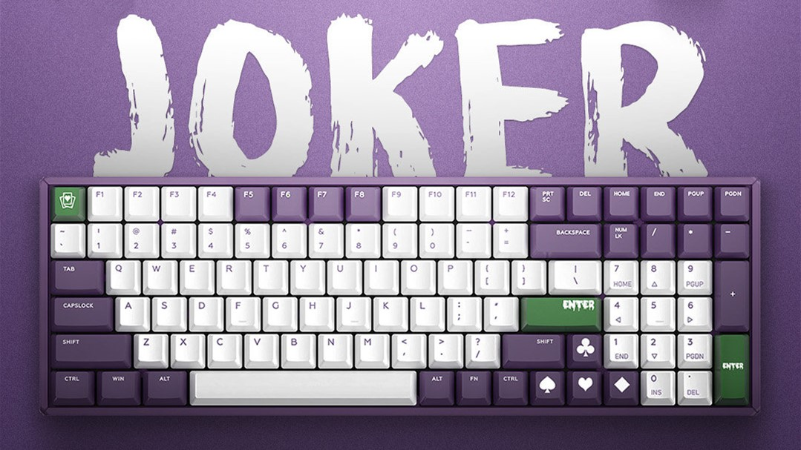
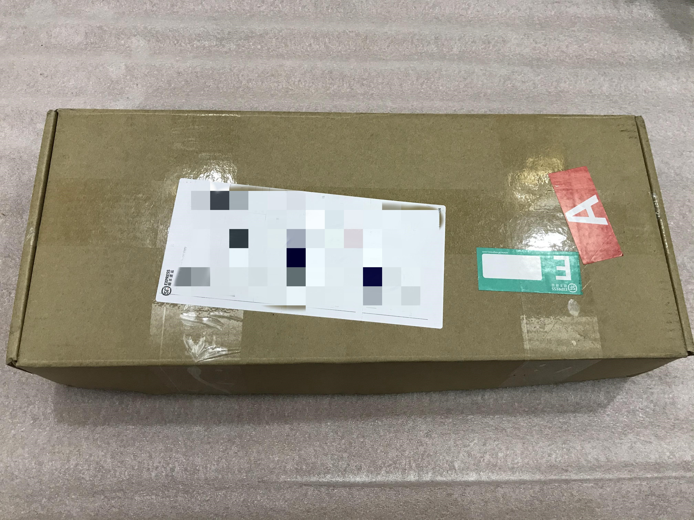
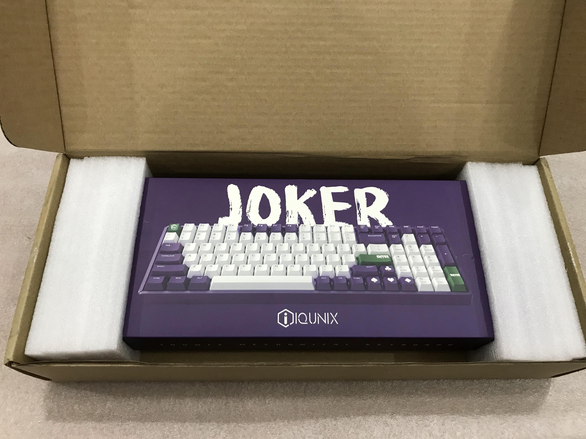
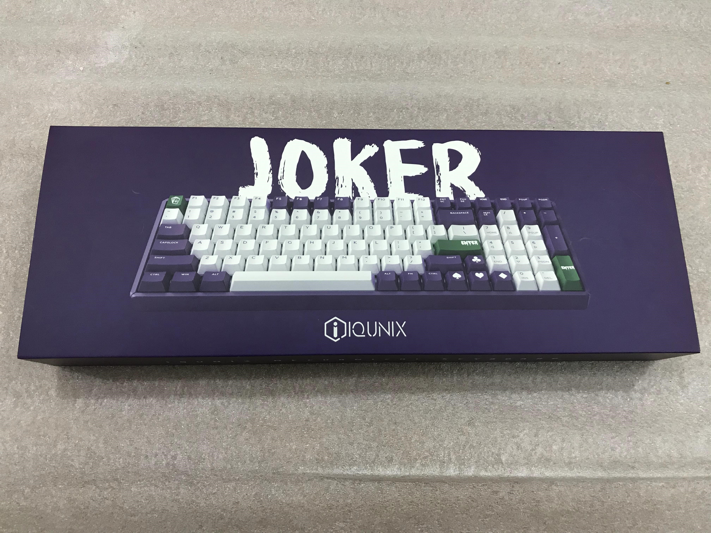
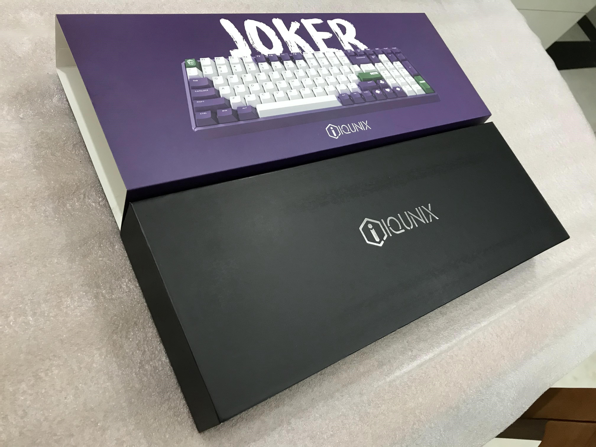
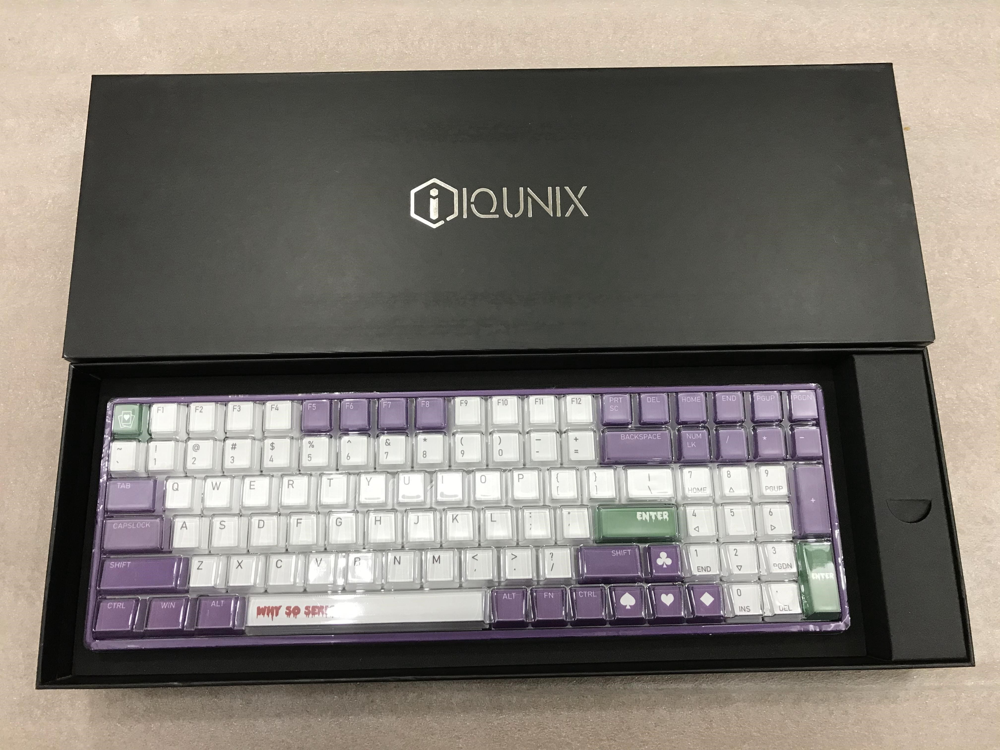
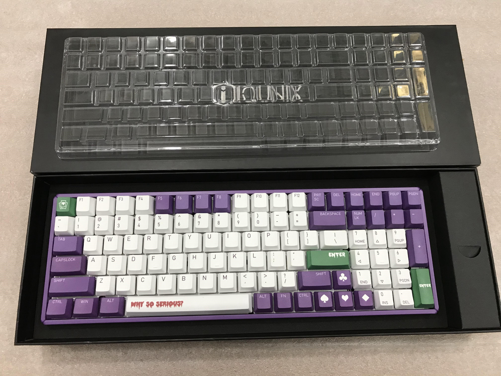
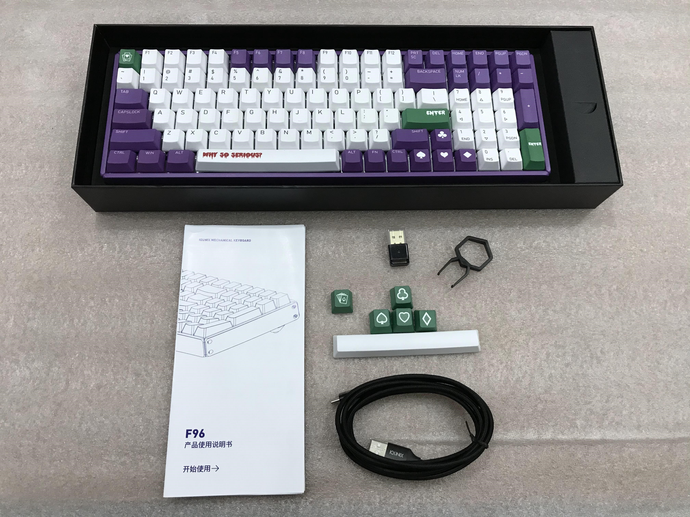
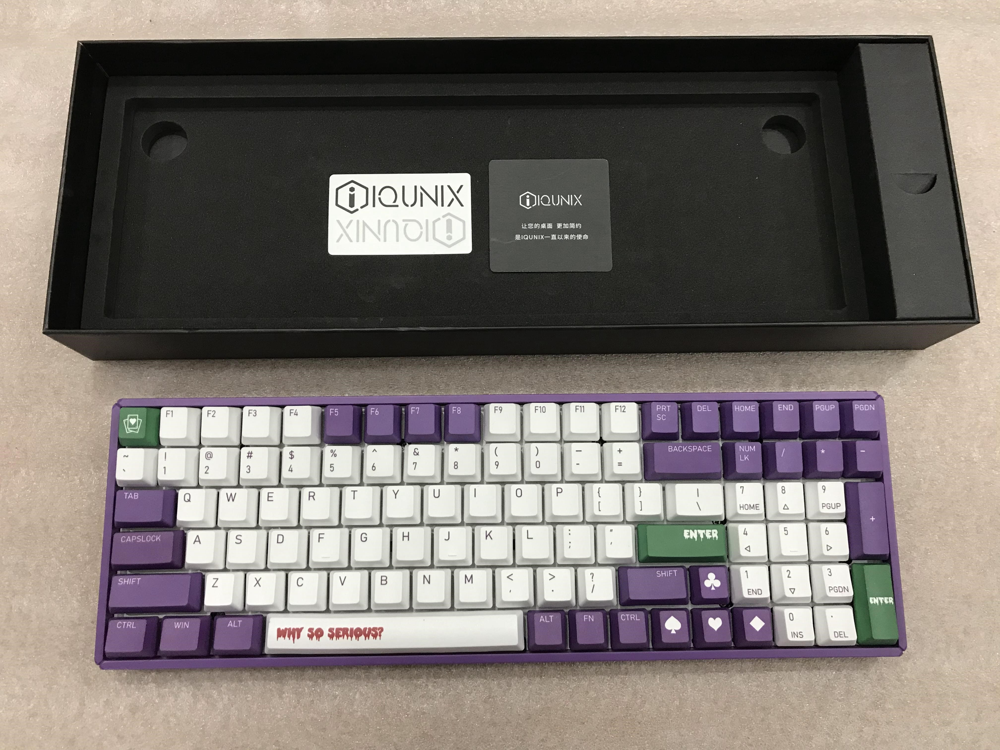
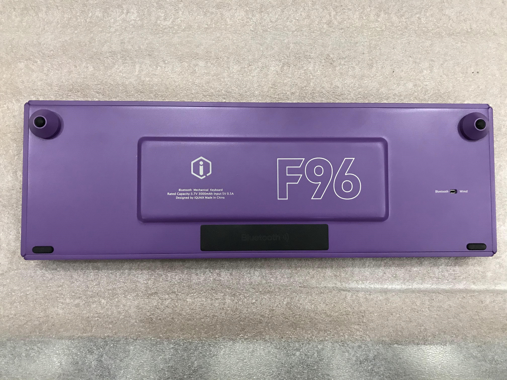

### 前言

在这之前，我一直使用淘宝 99 包邮的键鼠套装，后来鼠标换成了舍友送我的达尔优，使用上好的外设后，我开始考虑换键盘。

我看了好多键盘，都不太满意，感觉设计都很平庸，要么颜色非常丑，要么形状非常怪异。

最后发现阿米洛的樱花和 iQunix F96 都非常好看，不管是键帽设计，还是排列，都非常合我的心意。

最重要的是，他们两个都有双模版本，我很久不换外设的一个原因就是，想把键盘鼠标都一步到位换成无线的。无线真的非常提升体验，在我换到罗技 G304 和这把 F96 之后，我更加确信了。

阿米洛的樱花有几个点还是让我放弃选择，一是我感觉 68 键和 87 键不够用，我还是挺喜欢小键盘的；二是 108 键居然是 Mini USB 接口，这让我无法接受；三是 108 键还是觉得有些长，放在我的小桌子上不太好看，便携性稍差。

最后我趁着双十一下单了 iQunix F96 Joker 茶轴双模，12 期免息，真香。

### 开箱

首先是顺丰快递好评，快递小哥晚上八点多派送过来的，辛苦小哥啦。

这个大家伙拿着还挺有分量，包装非常厚实，牛皮纸下有两块海绵从两边包裹住键盘，中间是非常显眼的 Joker 字眼和键盘外形，底下有个 iQunix 的图标。

取下海绵，把牛皮纸放到一边，iQunix F96 Joker 的内包装就展现在我的面前。

还没完，内包装还有一个火柴盒抽拉的设计，下面的黑色包装依然非常大气。

这个黑色的包装是类似手机盒的设计，慢慢取下上面的盖子，有种非常舒服的阻尼感，怎么感觉像手机开箱 2333。

这次打开之后，终于看到我的键盘了，键盘上面有一个防尘罩。

右边的小盒子里装着拔键器、蓝牙适配器和 Type-C 数据线，Type-C 口也是我非常中意这款键盘的一个点，值得注意的是，这个数据线居然是编织线，真良心啊（其实 1000 块的键盘配这个也算不上多良心 2333）。

给这些配件拍个全家福吧。

拿出键盘，底下有两个凹槽，是用来吻合键盘底下的两个脚撑。还有一张 iQunix 贴纸，一张小卡片。

键盘背面的凸起是电池仓，下面黑色那块是蓝牙模块，右边有个开关，用来切换有线模式和蓝牙模式。

### 使用

- Fn+1 长按五秒可以开启配对，直接连接笔记本的蓝牙即可，没有蓝牙的电脑可以使用附赠的蓝牙适配器。
- 键盘指示灯在 G 和 H 键中间，按 Fn+X 可以查看电池电量，灯常亮后，闪烁次数代表电量，闪烁三次是 100%。
- Fn+F10 是调低音量，Fn+F11 是调高音量。Fn+F12 是打开计算器，这个功能真是吹爆，我在网上找了很久如何快捷键打开 Windows10 的计算器都没有找到。

### 感受

- 我非常喜欢这款键盘的设计，喜欢这种 96% 的排布方式，茶轴打字也非常舒服。

- 因为最近发生的事，加上刚看完小丑电影，这款键盘的主题非常契合我的心境。

- 一开始用蓝牙模式体验很一般，不用键盘的时候会自动休眠，偶现无法唤醒的 BUG，需要拿数据线连接电脑唤醒。在升级固件后，到现在还没遇到这个 BUG，体验还行。不过自动休眠的时间似乎有些短，经常看会儿视频，再按键盘，发现灯在闪，处在激活中，再按才能正常使用。
- 电脑开机后，想要 Enter 输密码，得按两下，按第一下后有个唤醒的过程，这个其实挺尴尬的。不过为了省电，好像也只能这么办，不知道其他蓝牙键盘是怎么处理的。
- 有小键盘真好。
- 键盘很有分量，放在桌子上稳如泰山。

### 售后

本来我打算换一下空格键，结果拆下来再也装不上了，按照网上的视频装了很多遍，都装不上，最后大力出奇迹，崩坏了龙豆。我当时就在想到底是哪个天才发明的平衡轴，气死我了，折腾两个小时。

无奈只好找客服，客服提出补发龙豆，并且给我发了安装视频，我才明白应该怎么安装。

因为个人原因，换了居住地，导致补发过程异常艰辛，其中经历了发错地址，发错配件等等事件，最终双十一购买的键盘，经历半个多月到今天才算终于能完整使用了。

还是非常感谢 iQunix 的客服不断给我补发，发得我都不好意思了，毕竟换地址是我的原因，弄坏龙豆也是我的原因。

### 总结

虽然遇到一些问题，但好歹都解决了，喧嚣过后，我认为 1000 块买这款 iQunix F96 Joker 还是值的，在我心中，这是我买过的第二值的产品，第一是 Airpods。