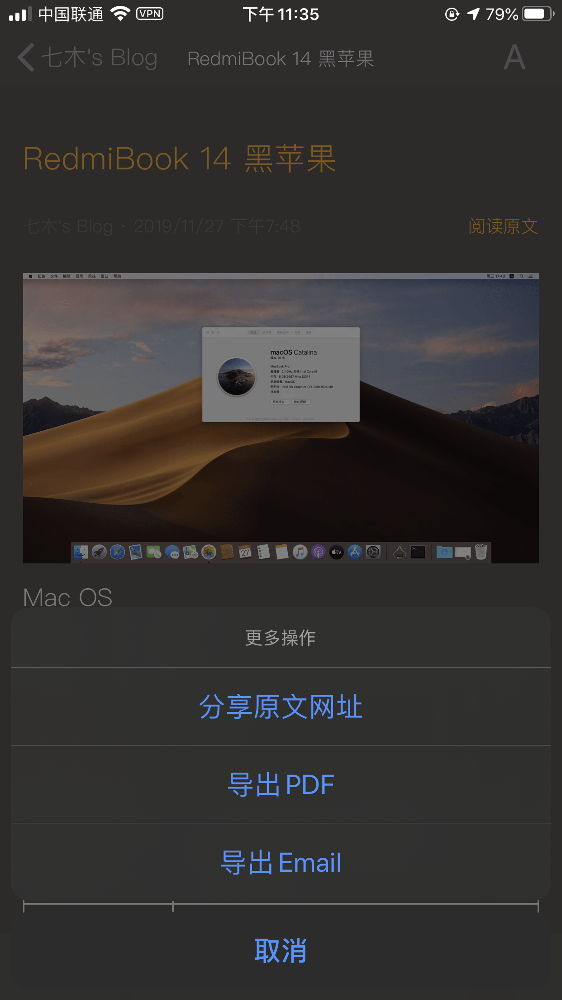

今天群里有个小伙伴不小心手欠把整个博客删除了，还好找到了三个月前的备份，而这三个月的内容是找不回了。

我临睡前打开了我的 RSS 阅读器，发现我之前有订阅过他的博客，而且这三个月内的文章仍然可以阅读。

这样我可以直接复制粘贴发给他，就能找回他的文章了。

没想到，更让我惊喜的是，这个 RSS 阅读器支持导出 HTML 文件，然后通过 iOS 自带的邮件应用，直接发送给他。

我使用的 RSS 阅读器正是我在之前那篇 [RSS：独立博客的好帮手](https://yltang.cn/archives/rss-helper-for-blog/) 中提到的 RSS Reader Prime，只支持 iOS。

