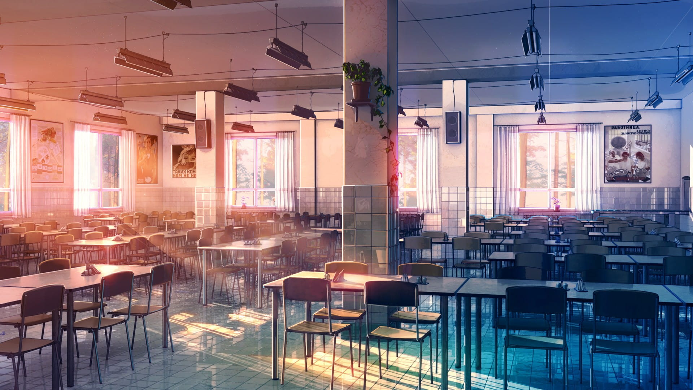

ICP 备案之后，还需要公安备案。在公安备案中需要选择网站是交互式还是非交互式，简单来说有评论系统就是交互式，而交互式需要网警上门核验，很麻烦。于是我打算将 @ 和 www 页面做成静态导航页。

如今想找个静态导航页还是挺难的，搜索关键字 HTML 模板，一堆上个世纪的模板网站出现在面前，让人梦回十年前。

不过还好，有 HTML5UP 这么个网站专门做静态模板，如果你不知道 HTML5UP 的话，那你大概率也见过他们制作的 [Dimension | HTML5 UP](https://html5up.net/dimension) 主题。

最终我找到现在这个 [Eventually | HTML5 UP](https://html5up.net/eventually) 这个模板，背景动态轮换非常适合做导航页。

点击查看：[我的导航页](https://luhe.xyz/)。

### 更新

因为有些 BUG 无法解决，加上作者也已修改样式，于是我也放弃了这个样式。

~~突然注意到 Maverick 作者的着陆页 [三无计划 | Triple NULL](https://www.imalan.cn/)，这个站点点击按钮弹出窗口并显示一个页面的功能，我非常喜欢，于是本前端小白花了点时间把这个功能 Ctrl+C 到我的导航页上了。~~

~~主要思路就是将三个静态文件：`font_1041623_qjcj60752f.css`、`main-13d7fc41f2.css`、`bundle-ffcbbae2ae.js`，分别下载到自己的站点并引入。再将自己站点的几个`<a href>`标签里增加`class="link top"`，就能实现弹出窗口的效果。~~

~~最后需要注意的是，因为原站也有`header`、`footer`标签，所以样式会混乱，需要自行把新引入的 css 文件中冲突的样式删除，结合使用 F12 和 VScode 格式化插件即可。~~

### 修改主页

1. 首先修改主页`index.html`文件中的标题，文字之类的个性化文字，在`head`标签里用`link`标签插入 ico 图标。

2. 删除文本框和按钮，改成文字超链接，这里借鉴了[群狼动力](https://volf.club/) 的样式，是否新标签页打开自行斟酌。

3. 底部`footer`部分的图标是 FontAwesome 的，你可以在 [这里](http://fa5.dashgame.com/#/文档/堆叠) 查看相关文档语法。我是这样写的：

   ```html
   <footer id="footer">
   <ul class="icons" style="font-size: 1.5rem;">
   	<li><a href="#" target="_blank"><i class="fab fa-qq fa-1g"></i></a></li>
   	<li><a href="#" target="_blank"><i class="fab fa-weibo fa-1g"></i></a></li>
   	<li><a href="#" target="_blank"><i class="fab fa-github fa-1g"></i></a></li>
   	<li><a href="#" target="_blank"><i class="fab fa-weixin fa-1g"></i></a></li>
   </ul>
   <ul class="copyright">
   	<li><a href="#" target="_blank">备案号</a></li>
   </ul>
   </footer>
   ```

### 修改 CSS

由于我的博客是居中风格的，如果导航页居左，会给浏览者视觉上的割裂。

1. 打开`/images/css`下的`main.css`文件，映入眼帘的第二行就是万恶的谷歌字体，注释或者删除这一行：

   ```css
   /*@import url("https://fonts.googleapis.com/css?family=Roboto:400,700");*/
   ```

2. 找到 357 行`header p`，添加一条`text-align: center;`：

   ```css
   header p {
     color: rgba(255, 255, 255, 0.5);
     position: relative;
     margin: 0 0 1.5em 0;
     text-align: center;}
   ```

3. 找到 286 行`h1`，添加一条`text-align: center;`：

   ```css
   h1 {
     font-size: 2.5em;
     line-height: 1.25em;
     text-align: center;}
   ```

4. `footer`部分跟`header`不太一样，我摸索了一阵，最后是这样修改的，从 838 行开始：

   ```css
   #footer {
     -moz-transition: opacity 0.5s ease-in-out;
     -webkit-transition: opacity 0.5s ease-in-out;
     -ms-transition: opacity 0.5s ease-in-out;
     transition: opacity 0.5s ease-in-out;
     bottom: 4em;
     color: rgba(255, 255, 255, 0.5);
     left: 4em;
     right: 4em;
     text-align: center;
     opacity: 0.5;
     position: absolute; }
     #footer .icons {
       margin: 0 0 0.5em 0; }
     #footer .copyright {
       font-size: 0.8em;
       list-style: none;
       padding: 0; }
       #footer .copyright li {
         border-left: solid 1px rgba(255, 255, 255, 0.25);
         display: inline-block;
         line-height: 1em;
         margin: 0 0 0 0.75em;
         padding: 0 0 0 0.75em; }
         #footer .copyright li:first-child {
           border-left: 0;
           margin-left: 0;
           padding-left: 0; }
       #footer .copyright a {
         color: inherit; }
     #footer:hover {
       opacity: 1; }
     #footer > :last-child {
       margin-bottom: 0; }
     @media screen and (max-width: 1680px) {
       #footer {
         bottom: 3.5em;
         left: 3.5em;
         right: 3.5em;
         text-align: center;} }
     @media screen and (max-width: 736px) {
       #footer {
         bottom: 2em;
         left: 2em;
         right: 2em;
         text-align: center;} }
     @media screen and (max-width: 360px) {
       #footer {
         bottom: 1.25em;
         left: 1.25em;
         right: 1.25em;
         text-align: center;} }
   ```

   主要是挨个添加了`right`字段和`text-align: center;`，删除了最后一段`max-height: 640px`部分。

5. 做完这些还没结束，有些移动端自适应还需修改，比如在 84 行，我将`640px`修改为`736px`正好是我的手机 iPhone7 Plus 的竖向逻辑分辨率。这样在我的手机上，`header`部分是偏上的，而到了类似 iPhone X 的全面屏上，由于手机较长，`header`部分是垂直居中的，方便单手操作。

6. 另外我还注释了 70 行到 72 行，使得横向分辨率无论拉到多小，`header`部分也会居中，而不是去到屏幕外。这里纯粹是我强迫症。

### 修改 JS

主要是修改背景图，很简单。打开`/images/js`下的`main.js`，在 38 行修改图片链接即可。

### 总结

还有些冗余代码，如原版模板中的`form`表单，也可以删除，但是我懒，就算了，F12 里没有多余加载项就 OK。